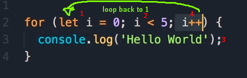

# Read: 08 - Operators and Loops

Expressions and operators are important for me to learn - I got a taste of them while doing the Lab 06 - we used them in if statements to check the content of our inputs and run different commands depending on the input.

*Complex expressions* use operators. We will recognise operators from mathematics - although in programming they're essentially shorthand for a function, even if you can't make your own operators. (Don't need to think about this, though)

I ended up covering some other things in this reading, like arrays/lists, what an index is, and primitives because loops and operators didn't seem to make much sense without also knowing this stuff, and I didn't want to skim over it if it was important later.

There are many kinds of operators:

## Comparison operators

Comparison operators are small pieces of logic on a program that tell the computer to take its inputs and process them in a certain way - ie:

    input1 = 5
    input2 = 7

    if (input1 and input2 are the same)
        then do 'sit down'
    else (input 1 and input2 are not the same)
        then do 'jump'

As you can see, we're *comparing* two pieces of data.

    Remember!!! we need to use == if we want to compare,
                               ===  if we want to be strict to type
                               not = that's an assignment.

---

Also keep in mind, most operators only work with primitive values. Ie - make sure your numbers are numbers, not strings.

For example, the plus operator `+` will look at it's operands (it's inputted data) and check for type:

- If **one** of the operands is a string, it will convert the other to a string and concatenate (combine) them.
- If both of them are numbers, it will add them as expected.
Another interesting thing is that *only* strings are changed.

If we write `4 + true` the console should return `5`, because true is a Boolean expression and will be computed as 1 in this context.

---

## Assignment Operators

We use an assignment operator each time we declare a variable and give it a value.

`=` is (probably?!?) the most common operator we'll use when programming. It is used to change storage locations.

In this case `myVar = 5` we're storing the value `5` at the location `myVar`

We could also use it assign an value to an array at an index.

Like `array[index] = value;`

### **JS supports:**

Arithmetic Assignment Operators - (+= also works for concatenation)

Bitwise assignment operators

Bitwise shift assignment operators

Logical assignment operators

---

I also discussed it in one of my earlier reading notes, but lets go over it again now, because I think I understand it more:

## Primitives

A primitive is a data types that isn't an object, has no methods, has no properties. They're our basic building blocks.

> We use primitives in 3D too! - we'll often start a more complex shape out of primitives, like cubes, spheres and planes.

The 7 types are:

- string
- number
- bigint
- boolean
- undefined
- symbol
- null

Primitives are immutable - (they can't be mutated ;) ) While a variable could have a primitive assigned to it, and that variable can be changed, the primitive itself isn't.

You *can* change objects arrays and functions.

---

## Quick Side note on indices, arrays and lists

    Important: `i` is used often in loops, as a shorthand varible for 'index'. An index is used to "point" to a data element. They start at 0, so what we would call the first item in a list or array would be indici 0, the second item indici 1, and so on.

Arrays and Lists are pretty similar - a collection of data. They differ in that arrays contain elements of the same data types, but lists can have different data types like `"John"` , `074837`.

## Loops and iteration

Loops give us a way to do an operation many times.

Think about if you wanted to tell someone to walk five steps to the right. While we don't even need to think about the instructions, the computer will need to be told 5 times to walk a single pace.

    step right
    then step right
    then step right
    then step right
    then step right

Not very efficient, right? We want a way to give the computer an action and have it repeat until it reaches the end (in this case, 5/5 steps)

---

There are a few different methods available:

`for` loops repeat until a condition (that we specify returns `false`)

    for (initial expression; condition like run as long as i is less than 5; then increment our initial expression by 1)
        then we run this command

    then return to the beginning of the for loop. i is now 1. Is i less then 5? then increment by 1, and run "this command" and so on. This is what it really looks like in js:
    
    for (let i = 0; i < 5; i++){
        console.log("Hello, world!")
    }

we can terminate the statement with `;`

`for while` - I'll come back and write notes on these - same general idea but little more specific.

`do while`

`for...in`

`for...of`

---

A `while` statement is like a for statement but reversed.

Instead of running until it evaluates false (if i = 6 and the conditional in a for loop is i < 5 it will stop running) a while statement will run until the condition evaluates to `true`

    let x = 0
    while (x < 5){
        x++;
    }

Here the loop will run until x is incremented to 5, and the conditional evaluates as `true`.

## Things I want to learn more about

More about the use cases for for loops and while loops. For loops look good for use on a list of unknown length, while a while statement looks better for a single, mutable variable, but I'm just guessing. 

JavaScript `auto-boxes` - I think it has something to do with how primitives are handled on a lower-level, does something like create wrapper objects around the thing we want to manipulate and changes that objects properties. As the name suggests, JS seems to handle this by itself, but seems interesting for the sake of it.
