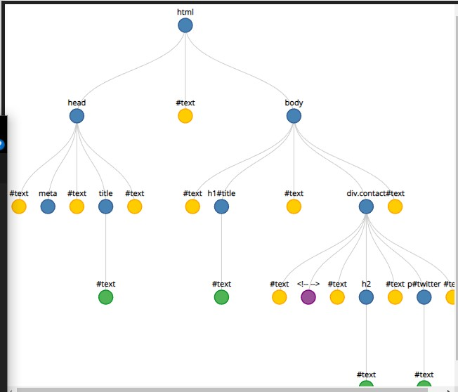

# Reading Notes: Module 1 : Introduction to Web Development - Class 01

## Servers & Clients

- Clients are anything that connect to the internet, like our PC, our phones, and have some software that lets them access the internet - like a web browser.

- Servers store webpages, sites or applications. Our client downloads these files from the server.

There are a few more steps in between these two simple concepts -

**Internet Connection** - what allows you to transfer data

**TCP/Ip** - Transmission control protocol and internet protocol - defines how the data is being transferred.

**DNS** - Domain name system - The client needs to find which server the data is being stored on. Your browser asks the DNS for its 'location'

**HTTP** - Application protocol (a system of rules that define how data is exchanged) that defines a language for the server and client to speak to each other.

**Component files** - Code files, (like script.js,styles.css and index.html.) and Asset files,(like images,  videos, and pdfs.)

Server will send a '200 OK' message if everything is good, and send over all the component files. Your browser will then start assembling them.

As we learned while inserting out script files externally before, the order in which your browser assembles these files is important. HTML file is parsed first > if the browser sees any `<link>` or `<script>` elements, it'll go have a look at those and then return to the HTML. (Some people like to put their `<script>` elements at the bottom of their body elements to make sure all the html is read before any scripts run, but this is more historical.) > browser generates an in memory a DOM tree:



    DOM - Document Object Model - Generated from the parsed HTML. 
    CSS OM - CSS also gets its own object model. 
    No object model for jS, +L. The jS is compiled and executed though.

As everything is built (DOM tree>CSSOM tree>executes JS), the user can begin to see the page on their screen.

## DNS

Websites don't have real names like `google.com` but instead, **IP Addresses**. These are no good for humans to remember, so we give them an alias like google.com. DNS servers match up your request for `google.com` to its *real* address (142.251.36.14)

## Packets

Instead of sending over everything in a big chuck we split it up into packets, thousands of small chucks making up your request. If we lose some of them, it's easier to replace a small chunk of the request instead of the whole thing, and we can route our packets along different paths (diff fibre optic cables), so that multiple people can download a webpage at the same time. Otherwise you'd have to wait in a que (of the 8.5 billion searches google receives daily.)

## Some design stuff

- Figure out what the website is about. Cyberpunk botanists? A render farm targeting corporations?

- what are we talking about in the page?

- What colours are we using? Make a wireframe, do some prototyping in Figma.

My background is in art and concept design so not gonna repeat myself too much. Just have fun and prototype!

## Q and A

My poem (ty to my friend George who helped):

    200 OK
    Content type HTML
    Ah, HTML

---

Some good resources for images are Unsplash and Flaticon.

---

Js is Dynamically typed, so we don't need to declare data types when initialising; however, a when we want something to be a string use `""`

ie.

````
let x = "This is a string"
let y = 23
let z = "23"

````

`z` would be a string.

---

A variable is a way to store data (and functions) in a named location. If we couldn't use variables, it would be very difficult to use information we needed more than once.

---

1. An Html attribute is a way to configure an HTML elements default behaviour. For example, the tag `<textarea>` can take the attribute `wrap` to control if the text submitted should wrap.

2. Anatomy of an HTML element : has an opening tag, possibly some attribute, like a class or an ID, and some content in the middle.

3. An article tag is good for independent content - an article on a type of flower, whereas a section tag is good for splitting up the page into sections duh

4. A typical page could contain divs, imgs, head, main, article, sections, navs, p, h1, h2, h3, h4, h5, h6, you could even make your own!

Here's all of them

```

 <a>, <abbr>, <acronym>, <address>, <applet>, <area>, <article>, <aside>, <audio>, <b>, <base>, <bdi>, <bdo>, <bgsound>, <big>, <blink>, <blockquote>, <body>, <br>, <button>, <canvas>, <caption>, <center>, <cite>, <code>, <col>, <colgroup>, <content>, <data>, <datalist>, <dd>, <del>, <font>, <footer>, <form>, <frame>, <frameset>, <h1>, <head>, <header>, <hgroup>, <hr>, <html>, <i>, <iframe>, <image>, , <input>, <ins>, <kbd>, <keygen>, <label>, <legend>, <li>, <link>, <main>, <map>, <mark>, <marquee>, <menu>, <menuitem>, <meta>, <meter>, <nav>, <nobr>, <noembed>, <noframes>, <noscript>, <object>, <ol>, <optgroup>, <option>, <output>, <p>, <param>, <picture>, <plaintext>,              ____
              ---|
  \/            /|     \/          
               / |\                            <i>, <iframe>, <image>, , <input>, <ins>,
              /  | \        \/
             /   || \
            /    | | \
           /     | |  \                   <pre>, <progress>, <q>, <rb>, <rp>, <rt>,
          /      | |   \ 
         /       ||     \                                    <td>, <template>, <textarea>,
        /        /       \                   
       /________/         \                                  
       ________/__________--/
 ~~~   \___________________/
         ~~~~~~~~~~       ~~~~~~~~                <details>, <dfn>, <dialog>, <dir>, <div>, <dl>, <dt>, <em>, <embed>, <fieldset>, <figcaption>, <figure>
~~~~~~~~~~~~~     ~~~~~~~~~
                               ~~~~~~~~~
, <portal>,  <rtc>, <ruby>, <s>, <samp>, <script>, <section>, <select>, <shadow>, <slot>, <small>, <source>, <spacer>, <span>, <strike>, <strong>, <style>, <sub>, <summary>, <sup>, <table>, <tbody>, <tfoot>, <th>, <thead>, <time>, <title>, <tr>, <track>, <tt>, <u>, <ul>, <var>, <video>, <wbr>, <xmp>

```

6. Use the metadata tag to describe meta data about the website that can't be done with other tags like `<title>` or `<link>`

7. When designing a website, you need to figure out the central theme of the website - "what is the brief?"

8. see above

9. A top level heading is important to us semantically - it will probably refer to the reason our page exists. `<span>` is quiet generic. 

10. Assists stuff like SEO and screen readers. 

11. making xhr requests. making interactive canvas elements. 

12. with a `<script>` tag. 


## Things I want to learn more about -

my new friend `<ruby>`

A deeper dive into HTTP - <https://dev.opera.com/articles/http-basic-introduction/>

<https://www.khanacademy.org/computing/computers-and-internet/xcae6f4a7ff015e7d:the-internet/xcae6f4a7ff015e7d:the-internet-protocol-suite/a/the-internet-protocols>
