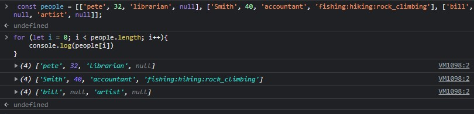

# Readings: HTML Lists, Control Flow with JS, and the CSS Box Model

1. Use an unordered list when you don't want your lists to be ordered - ie, semantically, the order isn't important for the website. If you're doing recipe instructions, you should use an ordered list, and use an unordered list for random bullet points about yourself.

2. To change the bullet style of your list, select it with CSS and do
`ul {list-style:(some-style, like none or square)}`

3. See three answer one ;)

4. You can changed the ordered list numbers by using attributes, like `revered` or `type-"i"` for roman numerals.

5. padding - inner space surrounding the element.
margin - outside space of the element itself.

```
Once, two brothers called margin and padding lived on a planet called div. Padding gave div an atmosphere, while margin represented the gap to the other planets. Sadly, they were always separated by a border and nothing interesting could happen. The end.
```

6. **Content Box** - Use inline-size, block-size or width and height. **Padding box** - Space around the content. **Border Box** you can style this. It's just something that wraps the padding box. **Margin** creates whitespace between it's (the elements) box and other elements. 
  
7. **Array** are sort of like a list. We can declare them the same way we do a variable. 
`let array = [1,2,3,4,5]`. The cool thing about this is we can access them using the index, which starts at 0. 

```
let arrayName = [1,2,3,4,5]

for (let i = 0; i < arrayName ; i++){
  console.log(arrayName[i])
}

```

1. You can store nearly anything in an array - other arrays, numbers, strings, booleans, objects, objects in arrays! I'm struggling to find out what I can't put in an array. 

2. The people array is great! Here's me printing out each of its sub-arrays. 



3. Some operators:

        `++` - Increment, like we use in loops

        `--` decrement, minus by 1

        `**` exponents!

        `+` = will attempt to convert the operand to a number. 

        `&&` - logical AND

        `||` - logical OR

        `!` - logical NOT

4. You'd get the result 10dog because c is equal to 0 and it won't impact anything. 

5. You'd want to write a conditional statement to make sure a case sensitive string is the exact same as another one - like typing in your email twice to make sure you've done it correctly.

6. Loops are really useful to go through items in an array of undefined length. You might want to run through a list of child elements and use something like `document.createElement("input")` to create an input form for each object (in an array)